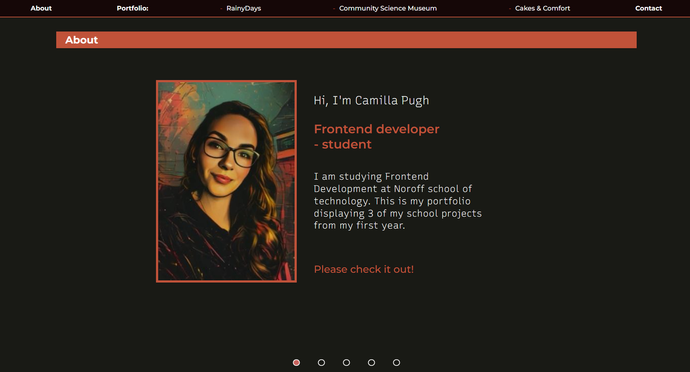

# Portfolio-1

The Portfolio 1 assignment is a single-page portfolio website showcasing three of my projects from the Frontend Development programme:

# Description:

 This repository contains the Portfolio 1 assignment for the Frontend Development course. I have turned it into a full-page vertical carousel implemented using vanilla JavaScript, HTML and CSS. The first slide is an about me, then the following three slides are the projects and finally a contact slide. It allows navigation through multiple sections of content using scroll, keyboard arrows, touch gestures and even click interactions. 

## The three projects:

- Cross-Course Project (RainyDays)
- Semester Project 1 (Community Science Museum)
- Project Exam 1 (Cakes & Comfort Blog)

## Built with:

- HTML 
- CSS
- JavaScript 

## Getting Started 

### Installing

1. Clone the repo: 

https://github.com/camiP89/Portfolio-1.git

2. Install Live server in VS Code - npm install

### Running

1. Right-click the index.html file and select "Open with live server".

## View my live website which is hosted on Netlify: 

[My live website]http://portfolio-1-cami.netlify.app/

# Contact

[My email address](campug04041@stud.noroff.no)

# Acknowledgments 

- Marvin Poole: Semester Project 1 - Community Science Museum. 

- Martin Kruger: Cross-Course Project (RainyDays)

- Talitha Kruger: Project Exam 1 (Cakes & Comfort Blog)

